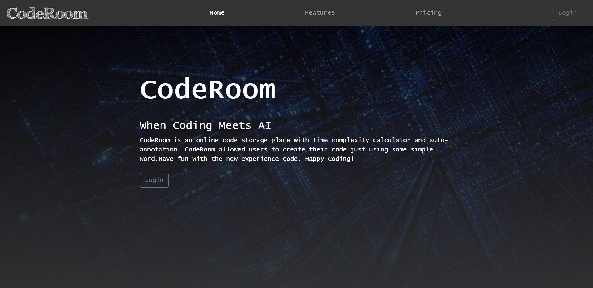

# CodeRoom

## About
CodeRoom is a online code storage project built with Spring. With OpenAI, CodeRoom allowed users to create their code just using some simple word. In addition, auto-annotation and time complexity calculator are also included in the project.

## Built with

CodeRoom is built in Spring Tool Suite with a MySQL database. OpenAI API is applied in this porject to code translation and time complexity calculation. CodeMirror is also used as a code editor package which allow user to edit multiple languages in the CodeRoom.

* [Spring Tool Suite](https://spring.io/tools)
* [MySQL](https://www.mysql.com/)
* [OpenAI](https://openai.com/api/)
* [CodeMirror](https://codemirror.net/)
* [Bootstrap](https://getbootstrap.com/)

