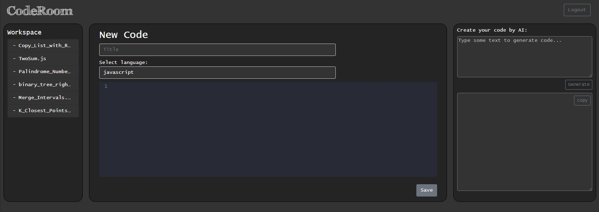
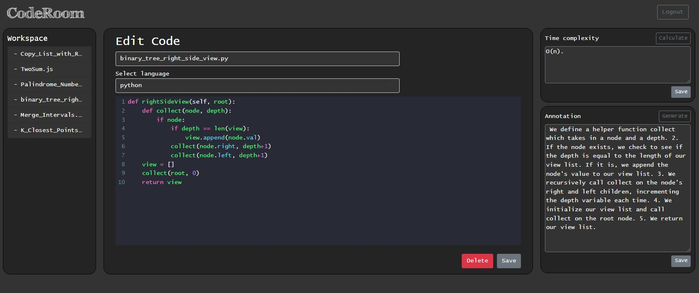

# CodeRoom

## About
CodeRoom is a online code storage project built with Spring. With OpenAI, CodeRoom allowed users to create their code just using some simple word. In addition, auto-annotation and time complexity calculator are also included in the project.







## Built with

CodeRoom is built in Spring with a MySQL database. OpenAI API is applied in this porject to code translation and time complexity calculation. The server ran OpenAI API is built seperately in Node.js.

CodeMirror is also used as a code editor package which allow user to edit multiple languages in the CodeRoom.


* [Spring](https://spring.io/tools)
* [Node.js](https://nodejs.org/en/)
* [MySQL](https://www.mysql.com/)
* [Express](https://expressjs.com/)
* [OpenAI](https://openai.com/api/)
* [CodeMirror](https://codemirror.net/)
* [Bootstrap](https://getbootstrap.com/)

## How to use
[Spring](https://spring.io/tools) and [Node.js](https://nodejs.org/en/) are needed to open the project. For the OpenAI API, the api key can be applied through [OpenAI](https://openai.com/api/), update the variable OPENAI_API_KEY in openai.controller.js. 
Start the OpenAI API server in Node with
```
cd server
nodemon server.js
````
In Spring Tool suite, install dependencies and start the full stack application.